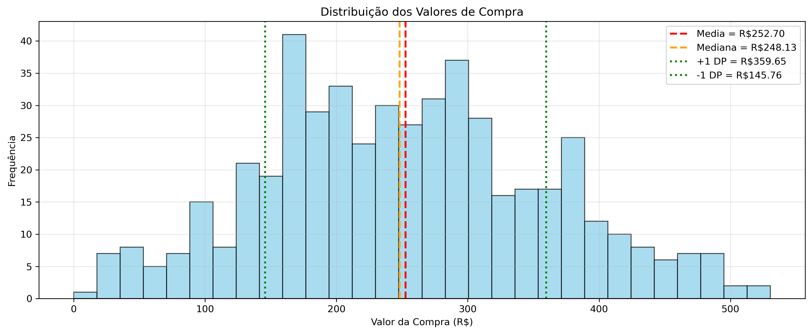
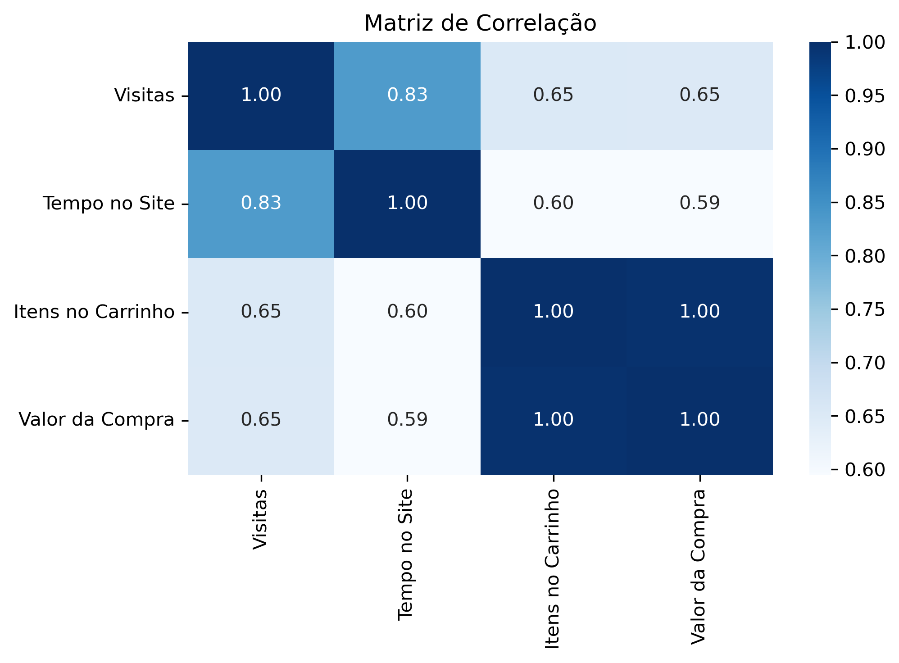

# Analise De Dados Para Marketing

    

Projeto desenvolvido em Python para simular uma análise exploratória de dados de uma plataforma de e-commerce, utilizando NumPy, Pandas, Matplotlib e Seaborn para gerar insights voltados à área de Marketing.

---

# Demonstração

O projeto gera automaticamente um conjunto de dados fictício contendo: 
- Numero de visitas;
- Tempo no site ;
- Quantidade de itens no carrinho; 
- Valor de compra.

Realizando assim análises estatísticas acompanhadas de gráficos.

## Distribuição Dos Valores de Compra



---

## Matriz de Correlação



---

# Objetivos do Projeto

O projeto tem como objetivo simular o comportamento de usuários de uma plataforma de e-commerce e realizar análises estatísticas para identificar padrões de consumo.

Durante o desenvolvimento foram aplicados conceitos de:

- geração de dados sintéticos;
- estatística descritiva;
- análise exploratória de dados (EDA);
- correlação entre variáveis;
- segmentação de clientes;
- visualização de dados.

---

# Funcionalidades

## Funcionalidades

- Geração automática de dados fictícios
- Estatísticas descritivas
- Segmentação de usuários
- Matriz de correlação
- Distribuição dos valores de compra
- Geração automática de gráficos
- Salvamento das imagens

---

# Tecnologias Utilizadas

- Python 3.11+
- Pandas 2.3.2
- Numpy 2.3.1
- Matplotlib 3.10.5
- Seaborn 0.13.2

---

# Estrutura do Projeto

```text
Analise-De-Dados-Para-Marketing/
│
├── image/
│   ├── DistribuiçãodosValoresdeCompra.png
│   └── MatrizdeCorrelação.png
│
├── charts.py
├── data_generator.py
├── config.py
├── utils.py
|
├── main.py
│
├── requirements.txt
├── README.md   
└── .gitignore
```

# Como Executar

## 1. Clone o repositório

```bash
git clone https://github.com/JoaoVitorDC25/Analise-De-Dados-Para-Marketing.git
```

## 2. Entre na pasta do projeto

```bash
cd Analise-De-Dados-Para-Marketing
```
## 3. Instale as Dependencias

```bash
pip install -r requirements.txt
```

## 4. Execute a aplicação

```bash
python main.py
```

---

# Conceitos Aplicados

- Python
- NumPy
- Pandas
- Matplotlib
- Seaborn
- Estatística Descritiva
- Análise Exploratória de Dados (EDA)
- Correlação
- Segmentação de Clientes
- Data Visualization

---

# Objetivo Acadêmico

Este projeto foi desenvolvido como parte dos estudos da formação "Fundamentos de Linguagem Python – Do Básico a Aplicações de IA" da Data Science Academy.

O principal objetivo foi consolidar conhecimentos sobre análise exploratória de dados, estatística descritiva e visualização de informações utilizando Python.

---

# Autor

**João Vitor Dias**
Técnico em Eletrônica • Estudante de Análise e Desenvolvimento de Sistemas

GitHub: https://github.com/JoaoVitorDC25

Linkedin: <https://www.linkedin.com/in/jo%C3%A3o-vitor-dias-14178a190/?skipRedirect=true>

### Áreas de interesse

-  Ciência de Dados
-  Inteligência Artificial
-  Visão Computacional
-  Desenvolvimento em Python

---

## Projeto em desenvolvimento

Este projeto integra meu portfólio de estudos em Python .

Novas funcionalidades serão adicionadas conforme avanço nos estudos e na evolução da aplicação.